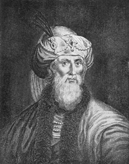
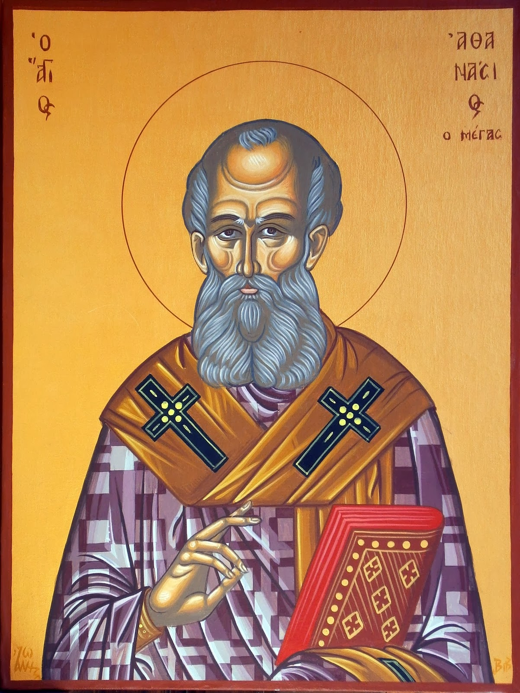

# ISM SUMMER STUDY SERIES:
# Church History

### **Week 2 (June 18):** Acts and the Didache

#### Assignment

- Read the book of Matthew
- Read [*The First Epistle of Clement to the Corinthians*](https://www.ccel.org/ccel/schaff/anf01.ii.ii.html)
	- There is a complete, printer-friendly version [here](http://www.ewtn.com/library/patristc/anf1-1.htm)

 

### **Week 1 (June 11):** Introduction

#### Lesson Outline

- Introduce teachers
- Class overview
- Class expectations
	- Participants covenant to make a best-effort to:
		- Spend **30 minutes reading the Bible** every day for the duration of the course
		- Spend **30 minutes reading extra-biblical sources** (on history, theology, biblical languages, etc.) every day for the duration of the course
		- Wear **nice pants and a collared shirt** when attending lessons
	- You can find a copy of the covenant for the class [here](covenant).
- Why study church history?
- How do we study church history?
- Discussion

#### Assignment

- Read the book of Acts
- Read the didache

 

