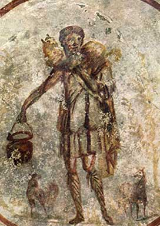
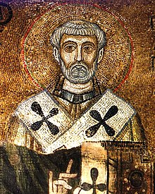

# ISM SUMMER STUDY SERIES:
# Church History

### **Week 4 (July 2):** Shepherd of Hermas and Epistle of Barnabas

#### Assignment (for next week)

TBA

 

#### Lesson Outline

- Study *Shepherd of Hermas*
- Study *Epistle of Barnabas*

 

### **Week 3 (June 25):** Didache and First Epistle of Clement to the Corinthians

#### Assignment (for next week)

- Read [*The Shepherd of Hermas*](https://www.ccel.org/ccel/schaff/anf02.ii.html)
- Read [*The Epistle of Barnabas*](https://www.ccel.org/ccel/schaff/anf01.vi.html)

 

#### Lesson Outline

- Finish reviewing Didache
- Introduce *First Epistle of Clement to the Corinthians*
- Discuss *First Epistle of Clement to the Corinthians*

 

### **Week 2 (June 18):** Acts and the Didache

#### Assignment (for next week)

- Read the book of Matthew
- Read [*The First Epistle of Clement to the Corinthians*](https://www.ccel.org/ccel/schaff/anf01.ii.ii.html)
	- There is a complete, printer-friendly version [here](http://www.ewtn.com/library/patristc/anf1-1.htm)

 

### **Week 1 (June 11):** Introduction

#### Assignment (for next week)

- Read the book of Acts
- Read the didache

 

#### Lesson Outline

- Introduce teachers
- Class overview
- Class expectations
	- Participants covenant to make a best-effort to:
		- Spend **30 minutes reading the Bible** every day for the duration of the course
		- Spend **30 minutes reading extra-biblical sources** (on history, theology, biblical languages, etc.) every day for the duration of the course
		- Wear **nice pants and a collared shirt** when attending lessons
	- You can find a copy of the covenant for the class [here](covenant).
- Why study church history?
	- Learn from others
	- Understand our place in history and trajectory
	- Worship God by observing His work throughout history
	- It's fun
- How do we study church history?
	- Reading
		- Find a time and place
		- Hide your phone
		- Set a timer
		- Read actively
			- Ask questions
			- Challenge authors and yourself
	- Listening
		- Listen actively
			- Take notes
			- Ask questions
	- Discussing
		- Be charitable
		- Disagree with ideas, not people
			- Don't take disagreement personally
	- Thinking
		- Don't be afraid to spend time thinking!
- Discussion

 

