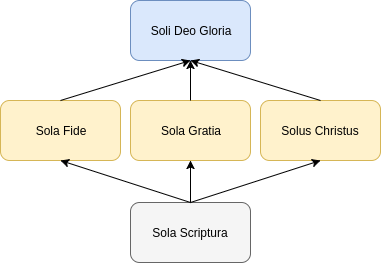

The principles behind the reformation are often summarized in five exclusive statements deemed 'Solae' or 'Solas':

- Sola Scriptura ("Scripture alone")
- Sola Fide ("faith alone")
- Sola Gratia ("grace alone")
- Solus Christus ("Christ alone")
- Soli Deo gloria ("glory to God alone")

These statements have been used both to describe what Luther and the other reformers believed as well as to discern what the Bible does and does not teach. Because we often see the five solas listed out in bullet points, we often do not consider the relationships between them. To describe these relationships, consider the graphic below:

On the bottom of the diagram (the starting point, if you will) is "Sola Scriptura" because the truth and authority of Scripture is essential for establishing any of the other solas. It is from Scripture that we find support for the claim that salvation is by faith in Christ alone and is granted to the sinner only by grace. The object of saving faith is Christ and the expression of saving grace is Christ's incarnation, life, death, and resurrection. Thus, Christ is the only mediator between God and man and is the single, exclusive means to salvation and a relationship with God the Father.

Each of these blocks in the middle, sola fide, sola gratia, and solus Christus, all point to the box on the top describing how all glory is due to God and Him alone. When it comes to salvation and the justification of sinners, God deserves all of the Glory. God revealed Scripture. He gives faith and has shown amazing grace (see Ephesians 2:1-10). The incarnation and work of Christ gives glory to each person of the Trinity as they all work to accomplish their predetermined purpose "to the praise of His glory" (see Ephesians 1:1-14; directly quoted from Ephesians 1:12).

Understanding how the solas relate to one another is helpful in fully grasping the truths they seek to express. One of the key take-aways from this principle is that scripture was not written nor was salvation purchased ultimately for our own benefit, but for God's glory. God is glorifying Himself in and through us and is working all things to that end.

> "He made known to us the mystery of His will, according to His kind intention which He purposed in Him with a view to an administration suitable to the fullness of the times, that is, the summing up of all things in Christ, things in the heavens and things on the earth. In Him also we have obtained an inheritance, having been predestined according to His purpose who works all things after the counsel of His will, to the end that we who were the first to hope in Christ would be to the praise of His glory. In Him, you also, after listening to the message of truth, the gospel of your salvation—having also believed, you were sealed in Him with the Holy Spirit of promise, who is given as a pledge of our inheritance, with a view to the redemption of God’s own possession, to the praise of His glory."
> 
> ~ Ephesians 1:9-14
