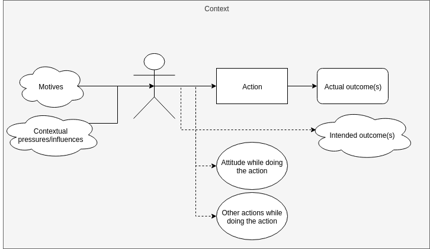

> "The modern Western church tends to be overly pietistic. **This often manifests in an attitude that says “if you really want to do God’s work, then be a missionary or a pastor.”** Pursuant to this view, everyone else is a sort of second-class spiritual citizen, not really doing things that matter all that much for the Kingdom. **The implicit message that comes through many times even in evangelical preaching is that if you are one of these second-class spiritual citizens, i.e., a non-missionary non-pastor type, then you should do whatever minor, secondary ministry God has given you, work hard at your “secular” job and make as much money as you can and live as frugally as you can, so that you can give as much money as you can to people who are really doing the Lord’s work.**"1

<aside class="marginnote">
  1 - Rodney Chrisman, <a href="http://www.rodneychrisman.com/2010/07/26/how-can-i-really-get-it-done-for-god/" target="_blank">How can I really get it done for God?</a>; (emphasis added)
</aside>

> "It is only when we offer up everything we do in worship to God that we finally experience His power coursing through every fiber of our being. The God of the Bible is not only the God of the human spirit but also the God of nature and history. We serve Him not only in worship but also in obedience to the Cultural Mandate. If Christian churches are serious about discipleship, they must teach believers how to keep living for God after they walk out the church doors on Sunday."2

<aside class="marginnote">
  2 - Nancy Pearcy, <a href="https://www.patheos.com/blogs/adrianwarnock/2005/01/more-from-nancy-pearcy-on-the-sacredsecular-divide/" target="_blank">More from Nancy Pearcy on the sacred/secular divide</a>
</aside>

In this blog post, I'm going to make some assumptions and pose a question that, I believe, is naturally raised if we adopt those assumptions. My goal in writing this blog post is to articulate the question in a way that may provoke a reader more capable than I to engage in answering the question.

# The Claim

Within most protestant churches, especially those influenced by the reformers, there is the claim that 'secular' work (like being a computer programmer for a fortune 100 company) is no more glorifying to God than 'sacred' work (like being a pastor). Being a pastor is not more glorifying to God than being a farmer; being a missionary is no more glorifying than being a businessman. Unfortunately, preaching at these churches often implies the opposite, but that is a different discussion for another time.1 The claim is that working as a professional minister is not 'better' or 'more spiritual' than a job in the 'secular' world. God can be glorified and equally glorified in my secular day-job as He can in the work of a pastor.

Here are a number of articles that articulate and support this claim:

- [https://relevantmagazine.com/god/1050-the-sacred-secular-dichotomy-2/](https://relevantmagazine.com/god/1050-the-sacred-secular-dichotomy-2/)
- [https://businessasmission.com/breaking-sacred-secular/](https://businessasmission.com/breaking-sacred-secular/)
- [https://www.patheos.com/blogs/adrianwarnock/2005/01/more-from-nancy-pearcy-on-the-sacredsecular-divide/](https://www.patheos.com/blogs/adrianwarnock/2005/01/more-from-nancy-pearcy-on-the-sacredsecular-divide/)

Assuming this claim is true (granted, we haven't tried to prove this claim, but taking it for granted for the sake of argument), I have a question.

# The Question

So here's my question:

**What makes an action glorifying to God?**

We claim that my secular work can be just as glorifying to God as pastoral work... how and why?

When pastors and ministers start talking about how and why an action glorifies God, things get really confusing (especially with the examples they give). Is an action only glorifying to God if I do something 'churchy' or 'spiritual' or 'sacred' (e.g. I'm not glorifying God if I write software for a secular company, but I am if I write software to help me study the bible). Is it only glorifying to God if my motives are good? Is it only glorifying to God if I'm listening to a sermon/'churchy' songs while doing my work? Is it only glorifying to God if I'm thanking God and thinking about Him while doing my work? Are sacred and secular actions *inherently*, equally glorifying to God?

## Examples

If these questions are unclear, let me give two examples from a recent discussion I had with a pastor. In this discussion, I asked the pastor what was the role of rest in the life of a believer and gave the example that I enjoy hiking as a way to rest, recreate, and rejuvenate. He replied something like: "Well, hiking is a good example; when you're hiking, you can be praising God for His wonderful creation and thanking Him for everything around you". I don't disagree! Hiking is a wonderful opportunity to worship God and be more in awe of Him. However, this answer is confusing to me. Is hiking only glorifying as long as I am explicitly thinking about God? Does it cease to be glorifying to God when I am simply in awe of a [bird's flight](https://500px.com/photo/233067293/Oh-to-be-able-to-fly-by-Floyd-Hightower), a [breath-taking sunset](https://500px.com/photo/231961887/Sunset-by-Floyd-Hightower), or [beautiful blossoms](https://500px.com/photo/222532691/-by-Floyd-Hightower)? Do I have to continually be stepping out of an experience to make sure I am explicitly, consciously thanking God? Or is it sin that I am not constantly, consciously thanking God?

The same pastor later gave an example of a job he had as a garbage man where he would listen to sermons all day while collecting trash. Again, was the action only glorifying to God because he was listening to sermons all day? If he were listening to classical music, would that have been glorifying to God? If he were listening to classical music without continually, consciously thanking and praising God, would that have been glorifying to God? Would the action have glorified God if he worked hard, with good intentions (say, to provide for his family and give to those in need), and without any music or sermons? What makes an action glorifying to God?

## A Visual Aid

To put my question differently, there are a number of different components to a single action (just a few of them are detailed below):

What attribute(s) of which component(s) make an action glorifying to God?
